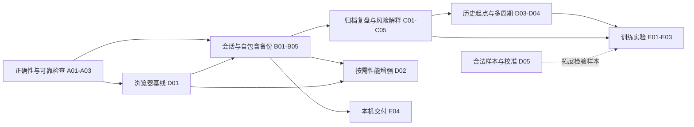

# 修补与优化计划

研究与计划日期：**2026-10-03**。基线提交：`9bc89a3`；工作分支：`feature/opt`。本阶段只进行调研、审阅与文档整理，**未实施本文提出的代码、数据库格式或交易规则变更**。

本文把已复现缺陷、已有阶段缺口和待验证产品实验转成可分批实施的任务。外部依据及八个产品的能力比较见 [补充研究](../knowledge/06-product-and-training-research.md)；当前已实现规则仍以 [数据与交易](03-data-and-trading.md) 为准，实际实现与验证状态以 [路线与验收](04-roadmap-and-acceptance.md) 为准。

## 1. 判断与范围

项目已经具备“看盘 → 开仓 → 回放 → 平仓 → 查看成交”的基础流程。Bid/Ask、Decimal 计算、逐根风控、保存事务和多窗口冲突处理值得保留。优化首先解决练习资料能否找回、用户能否解释风险与结果，其次改善大历史处理和训练效率。

本轮计划保持个人、本机、中文、单页和两品种的方向；继续使用当前 Vue、Pinia、ECharts、Decimal.js、IndexedDB 与 npm。新增登录、云同步、实时行情、真实下单、社区排名或经纪商连接没有当前需求依据。自动止盈止损等会改变成交规则的能力单列为后续评估，不与修补混在一起实施。

离线、信心记录、检查清单、隐藏日期、AI 复盘和短题训练已有竞品提供。可探索的差异是中文、本地、可解释、可携带的训练闭环，不能宣称市场首创或练习成绩证明实盘能力。

### 证据分类

| 分类 | 含义 | 本文的使用方式 |
| --- | --- | --- |
| 已复现 | 隔离运行得到明确输入和实际结果 | 可以列为修补任务；保留触发条件与环境 |
| 静态确证 | 当前源码、接口或文档能直接确认 | 可以列为现状或实现成本，不推断所有运行结果 |
| 阶段缺口 | 文档明确计划中，当前尚未提供 | 列为补齐能力，不称作现有数据被删除或损坏 |
| 待验证 | 设计判断、目标值或学习效果假设 | 先做小实验；失败可缩减，不记作已实现成果 |

## 2. 问题登记与优先级

“高”表示影响正确性、数据找回或主要练习闭环；“中”表示规模、效率或可访问性；“低”表示局部文档与交付完善。实施批次是计划顺序，不代替原 P0–P4 阶段名称。

| 编号 | 优先级 / 分类 | 现状与影响 | 当前证据 | 对应任务 |
| --- | --- | --- | --- | --- |
| F01 | 高 / 已复现边界错误 | 异常宽点差可使新开仓立即权益耗尽，却保留持仓并阻止推进 | `useSessionStore.openTrade/advance/canAdvance`；隔离复现见第 3 节 | A01 |
| F02 | 高 / 阶段缺口 | 故障 JSON 不含完整归档及历史源，且没有恢复入口，不能承担日常备份 | [README](../README.md)、[保存规则](03-data-and-trading.md#6-会话保存与恢复) | B03–B05 |
| F03 | 高 / 阶段缺口 | 新练习、切换品种或来源后，旧持仓和成交保留，但没有返回入口 | `SessionRepository` 仅 `loadCurrent`；产品 P3 约定 | B01–B02 |
| F04 | 高 / 阶段缺口 | 较早行情无加载入口，成交不能定位当时图表；复盘主要是成交流水 | `MarketChart` 最近窗口、`TradeJournal`、产品文档 | C01–C03 |
| F05 | 中 / 静态确证及隔离测量 | 历史初始化重复加载并全量校验同一数据集；列表读取含全部行情的整条记录 | `initialize → loadCurrent → loadDataset` 后再次 `loadDataset`；`listDatasets` 的 `cursor.value` | A02、B01、D01 |
| F06 | 中 / 静态确证 | CSV 重计算缺少进度与取消；大数据校验主要同步执行；完整成交数组也持续增长 | `historyCsv`、`historySource`、快照和保存路径 | D01–D02 |
| F07 | 中 / 阶段缺口 | 用户输入名义金额，却缺少每 pip 金额、假设退出风险、交易计划与结果解释 | `TradePanel` 和当前记录字段 | C02–C04 |
| F08 | 中 / 阶段缺口 | 历史练习从首根开始，缺少日期起点、预热和多周期 | `createHistory(dataset)` 固定首根；图表周期 M1 | D03–D04 |
| F09 | 中 / 静态确证 | 键盘能平移缩放，不能逐根选择历史 OHLC；画布没有等价行情表 | `MarketChart.handleChartKeydown/detailFrame` | C05 |
| F10 | 中 / 研究限制 | 已有两品种一周真实样本，模拟器尚未历史校准 | 样本元信息、模拟研究 S06 | D05 |
| F11 | 中 / 验证限制 | 整套运行存在长历史测试超时；浏览器用例完成后收尾挂起 | 2026-10-03 审阅检查，见第 9 节 | A03 |
| F12 | 低 / 文档残留 | 基线文档把已实现历史导入写为后续阶段，模拟研究写尚无样本 | 产品状态说明、研究 S06 | 本轮已定向纠正 |

未发现已确认的常规 Bid/Ask 颠倒、重复扣点差、未来价格参与结算或事务失败后静默覆盖原库问题。以上结论不等于所有输入、浏览器与配额场景均已验证。

## 3. 第一批：正确性与验证可靠性

### A01 新订单权益检查与旧记录兼容

**已复现条件：**合法历史 CSV 首根 `Bid=1、Ask=3`，账户初始资金 10,000 USD，买跌名义金额 10,000 USD。开仓后浮亏为 −20,000 USD、权益为 −10,000 USD，保存成功，持仓仍在、成交为空且没有耗尽提示；下一根不推进。耗尽检查仅在推进后执行，而权益不大于零又使推进入口不可用。

**推荐修补：**新订单先由既有引擎生成候选账户，再按统一账户估值检查成交后的权益。候选权益不大于零时拒绝订单，说明当前报价下点差成本已耗尽训练资金；不产生持仓、成交或新的保存版本。按内部 Decimal 值判断，不用显示到分的舍入值作风控条件。异常点差提示不能擅自截断或修改历史报价。

**兼容边界：**账本验证器用 `openPosition` 重建旧交易。不能直接加强该函数的默认限制，使过去合法保存的记录突然无法恢复。将新订单准入与历史账本重建分开；读取既有异常持仓仍暂停并明确提示，允许按当前可见报价主动平仓，不在读取时自动改写账本。另一方案是在新开仓事务内立刻耗尽结清，但会产生开仓即强制平仓、扩展同分钟操作校验，初学者体验和兼容成本更高，暂不推荐。

**影响模块：**`engine/execution.ts`、`stores/useSessionStore.ts`、交易错误提示及相关单元/流程测试；实施时将正式规则写入数据与交易文档，本文不作为第二套业务公式。

**验收：**正常多空和零点差仍可交易；异常点差导致权益小于零或恰为零的新单被拒绝，原快照不变；内部正权益但显示接近零时不误拒绝；旧异常订单能读取、暂停及主动平仓；拒单与保存失败重试均不产生重复交易。正常满额开仓后可用资金按现有规则显示零，不另引入保证金追缴或杠杆规则。

### A02 消除历史初始化重复校验

仓储恢复已经验证历史源，Store 应取得同一已验证、不可变的数据对象，避免再从 IndexedDB 完整读取并校验。优先扩展现有加载结果或提供受控的仓储读取入口；缓存按数据集 ID、指纹及数据库世代管理，清空、恢复或替换后失效。

不能以外来 `verified: true`、仅命中 ID 或 JSON 相同代替完整验证。当前数据集凭证是模块私有 WeakSet 身份，结构化克隆、数据库读取和 Worker 消息都会生成新对象；需要受控地建立验证身份，不能信任消息中的标志位。

**验收：**一次初始化只完整验证选中源一次；损坏源仍拒绝恢复；切换源、关闭仓储及备份恢复后不复用陈旧对象；页面和图表仍只取得已推进窗口与摘要。

### A03 检查耗时与测试收尾

分别测量引擎生成、完整校验、数据库读取与测试夹具构造，区分业务性能和测试准备成本。为长历史案例设置有依据的独立超时与规模，普通测试保留及时失败；不能通过无限放宽超时掩盖性能退化。核对 Windows 下测试服务与浏览器资源的退出归属，结束后固定端口释放。

**验收：**正常本机环境整套单元与生产流程命令返回退出码 0；长历史案例仍覆盖完整账本和跨块行为；失败可产生诊断信息；仅清理由本次检查启动的进程，不占用或终止用户服务。

## 4. 第二批：资料找回与完整备份

### B01 会话与数据集摘要

列表显示品种、来源、行情进度、持仓状态、成交数，以及确实存在的实际创建/保存时间。旧会话没有这些真实时间时显示未知，不把 2024 年行情时间当作用户练习日期。

数据集列表使用独立摘要记录，避免读取未选中来源的全部 `frames`。会话摘要也只保存列表实际需要的字段；与主体同事务更新，并保留可重建能力。既有损坏条目明确标记，继续显示可用条目，不自动删除或冒充有效记录。摘要属于展示索引，不能当账户或来源验证依据。

数据库迁移优先新增所需 stores，旧记录保持；回填可以分批恢复，缺少摘要不代表主体不存在。回填失败允许重试，不能因此创建空数据库覆盖原数据。

### B02 按 ID 加载及激活旧会话

新增专用加载与激活路径，不能直接 `save(oldSnapshot)`：当前保存接口会拒绝覆盖已有 ID，并且基准只关联当前已验证会话。

流程为暂停 → 成功保存当前候选 → 读取并完整验证目标 → 原子切换当前指针 → 暂停展示目标。目标损坏、缺源或当前保存失败时保持原练习。激活本身不改目标账户、交易、行情进度或交易 `revision`。

提交需同时核对原当前指针、目标会话版本及来源仍存在。当前指针增加单调激活序号，检测 A→B→A 但会话 revision 未变的切换，避免陈旧窗口误以为状态未改变；数据库世代用于整库恢复后的失效处理。旧格式目标仍沿用“内存准备迁移、首次后续保存提交”，激活不顺手改写旧记录。

**验收：**模拟/历史和持仓/空仓均可切换回来；两个窗口同时激活、验证期间目标更新或删除、A→B→A、保存失败及缺源均不静默覆盖；恢复暂停，下一根与原来源一致。

### B03 自包含备份格式

先提供版本化 JSON 文件；普通文件下载和选择即可，不先引入 ZIP、OPFS 或用户目录权限。格式设计在实施时统一写入数据与交易文档，候选要求如下：

| 内容 | 要求 |
| --- | --- |
| 备份版本 | `backupFormatVersion` 独立于数据库版本、快照 schema、模拟模型与参数版本；未知版本明确拒绝 |
| 会话 | 首版导出全部用户会话的原始进度、账户、持仓、完整成交与必要配置，不静默遗漏；选定范围导出另行评估 |
| 模拟历史 | 对应全部 `historyChunks`，校验块序、数量和会话外键；不只导出最近窗口 |
| 历史来源 | 恢复需要的完整不可变数据集及来源声明；默认不依赖再次下载或源文件仍在本机 |
| 决策记录 | 实施备注后包含相关记录及版本，关联所属会话/交易；摘要可重建 |
| 当前入口 | 当前会话标识必须指向包内有效会话；没有有效入口时不能凭空拼出当前账户；恢复后暂停 |
| 检查信息 | 文件和记录数量、内容指纹、版本与导出时间；哈希仅帮助完整性核对，不证明来源认证或防恶意篡改 |

正常导出先暂停并保存当前练习，再通过覆盖全部相关 stores 的一个 readonly 事务捕获一致原始视图，在事务外验证、序列化及计算检查信息。当前保存失败时，仍允许导出最近成功提交的完整数据库，明确其保存版本及可取得的保存时刻；未保存候选另作故障材料，不能混入已提交备份。若规模要求改为多个读事务，必须让所有业务写入推进变化序号，并核对导出前后的序号；仅依靠创建时数据库世代不能检测中途交易。文件大小、对象数及内存预算在 D01 的浏览器测量后确定；超限明确失败，不能删去旧行情后仍称完整备份。

正常备份与损坏原始材料/未保存候选的故障导出分开标识。无法取得完整归档时仍保留现有故障出口，但不称为可恢复备份。

### B04 校验、预览和原子恢复

首批支持两种行为：空库完整恢复；已有数据时追加为独立练习副本。默认追加，不合并两份账户或成交，不提供隐式整库替换。

空库恢复采用包内有效当前入口；已有数据时追加默认保持本地当前练习，只有用户明确选择“恢复后打开”才重映射并激活包内入口，恢复后保持暂停。若以后增加选定范围导出，入口只能指向包内会话，不能携带被排除的当前会话标识。

空库判定检查所有用户会话、行情块、数据集和备注，不能只看当前指针为空。追加时重映射会话 ID、模拟块外键和备注关联；交易 ID 在会话作用域内可以保留。历史数据集 ID 由品种和内容指纹确定，不能随机重命名；同 ID 的本地源全量验证一致后才复用，保留本地来源信息。同 ID 本地记录已损坏时报告冲突，不能以去重为名覆盖修复。

文件读取 → 结构与版本检查 → 来源及完整历史验证 → 已推进前缀账本重建 → 展示恢复范围/冲突 → 用户选择追加或取消 → 事务提交。缺块、重复 ID、悬空外键、缺源、非法数值、未知模型版本、超限文件均不能部分写入。

备份中的 `metadata.verified` 只是一份外来声明。恢复时保留其声明和说明，只有重新核对本机受信样本及证据才可重新显示来源已核对，不能因哈希正确就认证第三方来源。该要求针对尚未实现的备份入口，不是当前 CSV 导入已存在的漏洞。

正式写事务前完成哈希和候选验证；事务内不等待文件、Worker 或其他非 IDB 异步工作。提交核对预览对应的当前指针、数据库世代及必要变化序号，原子写入主体、块、源、摘要、备注和当前索引。失败、超配额与事务中止保留原库；只有 complete 后报告成功。

校验阶段可取消；提交前再检查取消状态。提交阶段暂时禁用取消或在完成前 abort，complete 后不能再声称“已取消、原数据未变”。恢复后的全部会话可访问，当前会话暂停；未来数据只保存在源所有者处。

**验收：**将含跨块模拟、真实/训练 Ask、未平仓、旧格式和备注的备份恢复到空白浏览器，逐项比对账户、成交、来源、进度及下一根；再验证追加、重复源、损坏本地源、过期预览、事务中止、超配额、取消及未知版本，原库始终保留。

### B05 存储健康与主动清理

显示可解释的保存状态、容量估算和持久存储申请结果，提供正常状态下的备份入口。`estimate()` 是估算，`persist()` 不保证批准，OPFS 仍属于 origin 存储；均不能代替外部文件备份。

删除会话或清空必须用户明确选择，并在事务内核对版本和引用。会话删除只连带自己的模拟块、摘要和备注；默认仅允许删除未被引用的数据集，不影响其他会话共享源。整库替换与清空可后续单独实现，先提供范围预览和备份入口，不自动按容量删除最早行情。

首批仅允许删除非当前会话。若以后支持删除当前会话，须先验证用户明确选择的接替会话，在删除事务内一并切换指针和激活序号；不能留下悬空 current、在其他会话仍存在时清掉索引，或自动替用户选择另一份账户。

## 5. 第三批：风险理解与复盘

### C01 成交定位与归档观察

点击一笔成交，读取开平仓周边的已发生行情；模拟按块加载，历史使用不超过该会话已推进位置的源切片。观察旧行情与当前交易进度分开，显示“复盘观察”和返回当前入口；不回滚余额、不重新结算、不把图表所选时间当当前下单时间。加载窗口有界，缺块时说明记录不可完整展示并保留原数据。

**验收：**跨窗口及跨块交易都能定位；当前报价/账户不变；未来成交和行情不可查询；观察时推进、来源切换和加载取消不混入另一会话；键盘可进入和返回。

### C02 可选计划与备注

最小输入是可选进场理由、计划退出条件和实际退出说明；常规交易可跳过，不要求先填分类。备注、标签与来源说明全部按文本处理。

计划与备注使用独立元数据版本，避免编辑文字改变交易公式或重写原成交。保存下单前计划的首次版本与后续修订，区分事前和事后记录；旧交易无计划时显示未记录，不倒填为事前判断。定义长度上限、并发编辑冲突、导出和删除关联后再设计存储字段。

### C03 基础统计与单笔过程

先提供笔数、净已结算盈亏、平均盈利/亏损和结果分布；同时给出样本数及统计范围。零交易、全部盈利、全部亏损和盈亏为零都有明确显示，不产生除零、无限利润因子或“稳定盈利”结论。

余额回撤仅描述已结算变化；权益回撤包含浮动盈亏。后者必须从完整已推进 Bid/Ask 与账户操作序列计算，不能用已平仓流水替代。负权益时绝对金额仍可展示，百分比基准不有效时明确标注。统计数值由纯引擎模块计算，不在组件复制账户公式。

最大浮盈/浮亏仅统计持仓存续期间已推进完成分钟的可平仓 Bid/Ask，并包含入场成本，标明“分钟采样”；不能拿 Bid OHLC 高低点声称得到做空 Ask 的分钟内最大风险。跨缺口也不能假定其间没有更大波动。首批不输出未经定义的 Sharpe、胜率排名或综合能力分数。

### C04 风险预览与盈亏解释

展示持仓数量、每 pip 对应美元变化、立即平仓成本，以及假设退出报价下的盈亏。预览调用引擎相同方向与报价规则；假设价格明确是哪一侧，不对缺少 Ask 的场景偷偷补成真实报价。计划价不等于自动订单，也不保证最大亏损；不把资金占用或名义金额解释为风险上限。

单笔解释按实际入场与退出报价核对，说明方向有利但尚未覆盖点差等情况。点差已通过双边报价进入盈亏，不再另扣一次“点差费用”。解释性拆分需要先固定口径，不能与实际结算不一致。

**验收：**文档固定盈亏案例、两方向、混合 Ask、零点差及异常点差预览与引擎一致；用户不操作也能跳过计划输入；不改变市价成交和账户规则。

### C05 首用与等价行情读数

提供可跳过的三步引导，每步只解释一项并对应当前操作；引导失败或退出不改变账户。给图表增加可发现的逐根读数方式及可展开的已发生行情表，键盘能读取历史时间/OHLC，不只缩放画布；播放不持续播报每根数字或抢焦点。

既有人工记录已经覆盖 320/360px，不能重新写成从未检查。后续补足自动化窄屏、较矮横屏、真实浏览器缩放与读屏检查；字体放大、浏览器缩放、图表可操作与系统性 WCAG 验收分别记录，不能互相替代。

## 6. 第四批：规模、历史效率与校准

### D01 建立浏览器性能基线

使用隔离数据库和合成文件，避免写入本人真实练习。样本覆盖 7,000 根、50,000 根、200,000 根，单个及多个数据集，并组合少量/大量成交。记录导入、列表、冷恢复、保存、归档查看、备份/恢复的总耗时、主线程长任务、内存峰值、取消响应与事务提交耗时；至少记录 Windows 当前常用浏览器及机器环境。

先完成 A02 与摘要改造，再比较同环境前后结果；单元测试计时和 fake-indexeddb 不能代替浏览器基线。拟议交互目标是处理中可操作控件在 300ms 左右响应、取消在下一个安全分批边界生效；这是待验证工程目标，不是已通过或标准要求。恢复总耗时和最大备份预算根据实测冻结，不能先承诺任意容量。

### D02 根据证据选择性能增强

优先消除重复读取和全对象列表，再采用分批计算及让出主线程。若仍无法满足交互目标，才引入功能内 Worker，明确数据所有者、结构化克隆成本和验证凭证建立路径。Worker 使用受控入口，不接受任意消息中的“已验证”声明；取消结果不能后来写入数据库。

长期成交数组的复制与整头写入需要单独测量，证据不足时不预建交易分表。数据集分块、流式备份和压缩也按内存/容量测量触发；任何增强都必须保留完整验证、原子提交、多窗口拒绝陈旧写入与旧格式恢复。

### D03 历史起点与预热

允许选择历史开始时刻和适量此前已发生的上下文。首个可交易时点为选定完成分钟；此前只观察，账户从该练习起点独立开始。元数据需区分数据集绝对索引、练习起点与图表窗口起点，避免把进度或账本当作从数据集首根交易。

跳到以后时刻应创建独立练习或顺序推进所有已有持仓风控；不能只把 currentQuote 换成未来价。首批只做创建时选择起点，持仓中的任意跳转后置。周末/缺口保留原样，不补假分钟。

**验收：**选定起点前行情可观察但不可交易；起点后未来不可见；无预热、资料开头、中间与末尾、缺口和恢复一致；旧历史快照仍按原起点语义恢复。

### D04 M5/H1 图表观察

仅从已推进 M1 聚合更高周期，交易仍按当前完成分钟 Bid/Ask 执行。根据 UTC 时间区间聚合，不按每五条/六十条记录凑柱；缺口会使区间不完整，不能静默补数据。未完成高周期柱随可见进度更新并标注；完整未来高周期 OHLC 不可提前读取。

成交标记保留实际成交时间与价格，高周期只改变观察映射；切换周期保持时间观察范围，同一 ECharts 实例更新。首批不增加技术指标；相关 FX Blue 多周期未来信息警示见补充研究 R08。

### D05 模拟校准与留出验证

扩大经核实个人用途的跨时期样本，区分来源、时区、双边报价、缺口及许可。现有一周可以检查转换和流程，不能代表各时段、事件与长期分布；不自动抓取受限制数据，不把价格文件随公开仓库提交。

按完整日/周/月划分参数估计、调参及保留样本，记录尝试次数和版本；已查看或用于调参的片段不能继续称未见检验。比较中间价收益分位数、方向/波动相关、日内季节性、点差分布、极端变化及 OHLC；去季节化和事件作用分开，避免重复放大。简单留出也不能消除反复试验产生的过拟合，不在首批引入完整策略优化器或凭单一得分宣布逼真。

调整模型参数前保存版本与复现样本，并定义既有会话继续旧参数还是显式迁移；不能恢复同一练习时静默换参数。数据不足时继续标为训练设定，不以强行拟合当前一周取代证据。

## 7. 第五批：小规模训练实验与交付

| 编号 | 实验 / 工作 | 最小形式与前置条件 | 拟议检查与退出条件 |
| --- | --- | --- | --- |
| E01 | 过程与结果分开复盘 | 依赖 C02–C04；对照事前计划与实际操作，允许不交易 | 盈利违背计划与亏损遵守计划能分别解释；跳过记录不受惩罚；规则说明不输出买卖建议 |
| E02 | 同片段比较与未见片段检验 | 依赖 B03/C01/D03；复制练习，保留第一份，标记已见、规则版本与来源指纹 | 原账本不改写；重练与未见结果分开；若只是记住走势，不宣称能力提升 |
| E03 | 报价与风险短任务 | 依赖 C04/C05；点差、每 pip 金额、方向有利仍亏损等固定例题 | 金额与引擎一致；用另一组等难度未见题检验理解；本人试用失败时先改说明，不扩大课程体系 |
| E04 | 本机启动与离线交付 | 接续原 P4；双击入口、固定 origin、端口检查、可解释退出 | 127.0.0.1:4173 占用明确失败；依赖与样本准备后物理断网验证；恢复旧账户且暂停；运行不请求外部资源 |

以上学习效果均待验证。结果偏差与提取练习研究支持设计问题，不直接证明外汇训练有效。先用本人多次练习收集理解错误、完成耗时和操作负担；不增加遥测、注册或外部用户数据。保持个人自测的证据级别，不把单人前后测写为因果研究或实盘表现。

## 8. 自动订单等扩展的决策门槛

| 候选 | 值得研究的理由 | 进入实施前必须解决 |
| --- | --- | --- |
| 自动止盈止损 / 挂单 | 可以练习预先定义退出和风险纪律 | 用完成分钟触发并按末组报价成交，或采用更细双边数据；当前 Bid OHLC 加末组 Ask 不足以还原做空触价和同分钟先后。须定义跳空、同分钟双触发、暂停下单、修改/取消、耗尽优先级、原因枚举与旧账本兼容 |
| 部分平仓 / 多仓 | 更接近成熟工具，可能支持特定练习 | 数量拆分、资金占用、记录重建、各仓风险与界面复杂度；需有实际需求后另立方案 |
| 成本模型扩展 | 可以研究交易成本对结果的影响 | 分别定义佣金、滑点和隔夜费的触发及来源，不能重复扣点差，也不能假称覆盖所有经纪商 |
| 绘图和少量指标 | 可支持特定观察任务 | 先说明要解决哪一种练习；指标仅读已推进数据，键盘和持久化可用；不以数量为目标 |
| AI 解释 / 云服务 | 可能降低解释编写成本 | 当前无必要证据；数据发送、运行联网、费用与错误建议都会改变范围，暂不纳入 |

若以后采用仅分钟末组触发，应明确这是较粗的训练规则，并非触价即按计划价成交。若用 OHLC 推断顺序，必须标成假设并展示歧义；不能把某平台的策略回测器默认路径当作本项目 Replay Trading 或真实市场事实。

## 9. 验证安排与本次证据

### 本次已执行的审阅证据

| 项目 | 环境 / 结果 | 能说明什么 |
| --- | --- | --- |
| 源码与文档审阅 | 基线 `9bc89a3`，引擎/Store/存储/图表/现有测试 | 问题与当前接口关联；不能替代所有运行场景 |
| 边界复现 | Node、Vite SSR、fake-indexeddb 的隔离数据库；F01 复现 | 异常输入下有明确状态错误，未读写用户浏览器数据库 |
| 大历史实验 | 合成 200,000 根、约 10.4MB；解析约 2.50s、首次让出前约 1.36s；两次源加载约 6.22s/5.99s | 重复工作与同步成本存在；不作为浏览器性能或配额通过记录 |
| 构建及类型 | `npm run build` 成功；有既有单包尺寸提示 | 当前构建可生成；不是新计划已实施 |
| 单元检查 | 最新整套 238/239 通过，一项长历史测试超时；该项单独运行通过 | 验证耗时不稳定；不将整套记录为通过 |
| 生产浏览器流程 | 28 条用例均输出通过，收尾进程挂起并清理 | 用例行为有正向证据；完整命令未正常结束，不记录整套通过 |
| 本轮文档整理 | 只做编码、链接、差异和计划一致性检查 | 本阶段不重跑应用整套检查；检查结果另见路线记录 |

### 实施时按变化运行

- 交易、回放或存储任务：相关单元、Store/Repository 场景、类型检查；集成交付执行构建。
- 完整备份、会话激活、历史起点与多周期：补关键生产浏览器流程，使用隔离数据库并验证失败不写入、无未来数据和多窗口冲突。
- 文案和局部样式：定向焦点、错误、按钮状态、布局与可读性；不因文档变更重复全仓测试。
- 性能与物理断网：单独记录环境、数据规模、实际值和限制，不由单元测试或“非本机请求为零”推断完成。

### 交付条件

每批交付应能独立使用，列清已实现、已验证和未完成项。B 批完成条件必须包含空白浏览器恢复和旧练习返回；C 批必须能定位旧成交并解释风险；D 批的优化必须给出相同环境前后测量。数据库升级提交前失败由升级事务回滚；升级完成后不能降低 IndexedDB 版本，旧代码可能无法打开新库，应交付兼容新格式的修复版本，或由外部备份恢复到明确的独立目标。不能把退回旧代码承诺为通用回滚，也不能通过删除用户数据恢复可用。

## 10. 依赖、拆分与实施入口

建议按 A01、A02、A03、B01–B02、B03–B04、B05、C01、C02–C04、C05、D01–D02、D03–D04、D05、E 各组形成可审阅的小批次。D01 在早期先测已有路径，B03–B04 原型补测后冻结备份预算，优化后再复测；不是等整批备份交付后才开始性能研究。D05 的资料研究可独立推进，不阻塞基础修补或使用现有样本的小实验。工作量相对为：A/C05 小至中，B/C01/D03–D04 中至大，D05 随合法数据覆盖和分析结果变化；未据此承诺工期。

实施涉及的实际文件以任务模块为边界；只有存在职责需要才新增 `storage` 备份模块、`features/journal` 复盘组件和纯统计模块，不预建通用服务层。依赖操作优先原生能力和现有库，新增依赖必须在具体任务中说明收益与许可。

计划取舍已给推荐路径；下列事项在实际开发前需要结合试用或原型冻结，当前不能写成既定行为：备份容量上限、最终大文件格式、整库替换支持、计划字段负担、是否需要自动订单及其执行规则、模拟参数迁移策略。这些决策不会阻碍 A 批和基础会话/备份研究；涉及交易规则或数据保留的改变须在实施时明确范围。

开发交付遵循仓库保护与任务分支要求。本次文档留在用户指定的 `feature/opt`，不合并到 `main`；后续修补只有得到实施指令后才开始。
